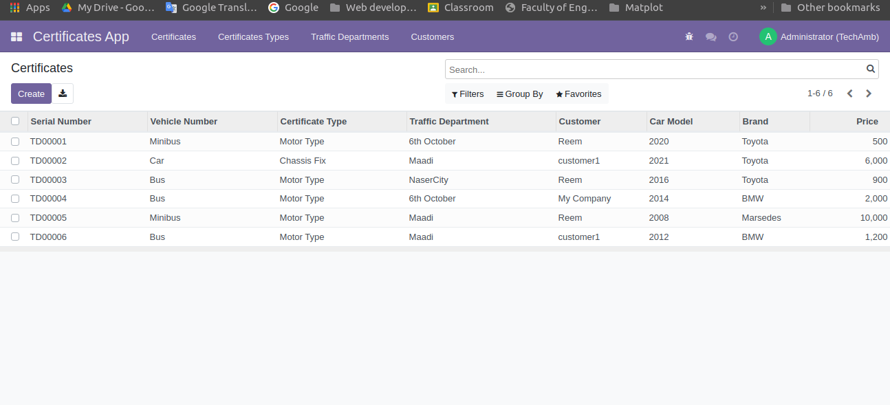
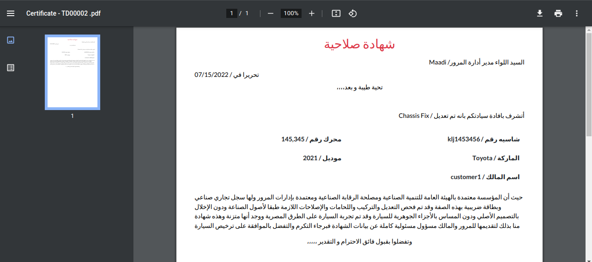

# ValidationCertificateApp
### Instalation

- Add CertificateApp folder in custom addons directory 
- Run Odoo Server and update Apps List .
- Search for Certificate App and install it .

#System Overview

> Normal User has access to his created certificates only.

> Normal User read only to created certificates type.

> Normal User read only to created Traffic departments.

> Form View of certificate without printing it .   

> Form View of certificate after printing it one time .   

> Supervisor User view all System Certificates 

> Supervisor User Can allow any certificate to be reprinted again .

> Printed Validation Certificate 

# Certificate App Users

### Supervisor

> Can Read/Write/Create/unlink all Models .
> Can reallow certificate to be printed again.

### Normal User
                    
> Can Read only Certificate Types , Traffic departments , Vehicle Brands.
> Can Create/Write and Read his Certificates Only .
note:: write in order to be able to print certificate .

## All system is supported in 2 languages Arbic and English .

